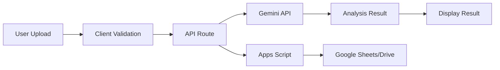

# AI Faceshot Analyzer - 프로젝트 가이드라인

## 📖 목차

1. [프로젝트 개요](#-프로젝트-개요)
2. [아키텍처 설계](#-아키텍처-설계)
3. [개발 규칙](#-개발-규칙)
4. [컴포넌트 가이드](#-컴포넌트-가이드)
5. [API 설계](#-api-설계)
6. [상태 관리](#-상태-관리)
7. [스타일링 규칙](#-스타일링-규칙)
8. [테스트 전략](#-테스트-전략)

## 🎯 프로젝트 개요

### 목적

AI를 활용한 프로필 사진 분석 서비스로, 사용자의 프로필 사진을 인물/배경/감성 측면에서 평가하고 개선 포인트를 제시합니다.

### 핵심 기능

1. **이미지 업로드**: 프로필 사진 업로드 및 미리보기
2. **AI 분석**: Google Gemini API를 통한 이미지 분석
3. **결과 제공**: 점수 및 피드백 제공
4. **데이터 저장**: Google Sheets/Drive 통합

### 기술 스택

- **Frontend**: Next.js 15, React 19, TypeScript
- **Styling**: Tailwind CSS
- **AI**: Google Gemini API
- **Storage**: Google Apps Script (Sheets + Drive)
- **Analytics**: FingerprintJS

## 🏗 아키텍처 설계

### 레이어 구조

```
┌─────────────────────────────────────┐
│         Presentation Layer          │
│     (React Components + Pages)      │
├─────────────────────────────────────┤
│         Business Logic Layer        │
│    (Hooks, Utils, Validation)      │
├─────────────────────────────────────┤
│           API Layer                 │
│    (Next.js API Routes)            │
├─────────────────────────────────────┤
│         External Services          │
│  (Gemini API, Apps Script, etc)    │
└─────────────────────────────────────┘
```

### 데이터 플로우



## 📐 개발 규칙

### 네이밍 컨벤션

#### 파일/폴더

- **컴포넌트**: `PascalCase` (예: `UploadSection.tsx`)
- **유틸리티**: `kebab-case` (예: `client-utils.ts`)
- **타입**: `PascalCase` (예: `AnalysisResult`)
- **상수**: `UPPER_SNAKE_CASE` (예: `MAX_FILE_SIZE`)

#### 변수/함수

```typescript
// 변수: camelCase
const userName = "홍길동";
const isLoading = false;

// 함수: camelCase, 동사로 시작
function validateName(name: string): boolean {}
function handleSubmit(data: FormData): void {}

// 컴포넌트: PascalCase
function UploadSection({ onUpload }: Props) {}

// 훅: use 접두사
function useAnalysis() {}
```

### Import 순서

```typescript
// 1. React/Next 관련
import { useState, useEffect } from "react";
import { NextRequest, NextResponse } from "next/server";

// 2. 외부 라이브러리
import Script from "next/script";
import Link from "next/link";

// 3. 내부 컴포넌트
import UploadSection from "@/components/UploadSection";

// 4. 유틸리티/타입
import { validateName } from "@/lib/validation";
import type { AnalysisResult } from "@/lib/types";

// 5. 스타일
import "./globals.css";
```

### Export 규칙

```typescript
// 페이지 컴포넌트: default export
export default function HomePage() {}

// 일반 컴포넌트: default export
export default function UploadSection() {}

// 유틸리티/훅: named export
export function validateName() {}
export function useAnalysis() {}

// 타입: named export
export interface AnalysisResult {}
export type ViewSection = "upload" | "contact";
```

## 🧩 컴포넌트 가이드

### 컴포넌트 구조

```typescript
// 1. Import
import { useState } from "react";
import type { ComponentProps } from "@/lib/types";

// 2. Props 인터페이스
interface UploadSectionProps {
  imageBase64: string | null;
  onImageChange: (e: ChangeEvent<HTMLInputElement>) => void;
  onNextClick: () => void;
}

// 3. 컴포넌트
export default function UploadSection({
  imageBase64,
  onImageChange,
  onNextClick,
}: UploadSectionProps) {
  // 4. State & Hooks
  const [isUploading, setIsUploading] = useState(false);

  // 5. Event Handlers
  const handleUpload = () => {};

  // 6. Effects
  useEffect(() => {}, []);

  // 7. Render
  return <div>{/* JSX */}</div>;
}
```

### 컴포넌트 원칙

#### SRP (단일 책임 원칙)

```typescript
// ❌ Bad: 여러 책임을 가진 컴포넌트
function ProfilePage() {
  // 데이터 페칭, 폼 검증, UI 렌더링 모두 처리
  const [data, setData] = useState();
  const [errors, setErrors] = useState();

  const fetchData = async () => {};
  const validateForm = () => {};
  const handleSubmit = () => {};

  return <div>{/* 복잡한 UI */}</div>;
}

// ✅ Good: 책임 분리
function ProfilePage() {
  const data = useProfileData(); // 데이터 페칭
  const { validate } = useValidation(); // 검증 로직

  return <ProfileForm data={data} onValidate={validate} />;
}
```

#### Props Interface

```typescript
// ✅ Good: 명확한 Props 타입
interface ButtonProps {
  variant: "primary" | "secondary";
  size?: "sm" | "md" | "lg";
  disabled?: boolean;
  onClick: () => void;
  children: React.ReactNode;
}
```

## 🔌 API 설계

### API Route 구조

```typescript
// src/app/api/[endpoint]/route.ts
import { NextRequest, NextResponse } from "next/server";

// POST 메서드
export async function POST(request: NextRequest) {
  try {
    // 1. 요청 파싱
    const body = await request.json();

    // 2. 검증
    if (!isValid(body)) {
      return NextResponse.json({ error: "Invalid request" }, { status: 400 });
    }

    // 3. 비즈니스 로직
    const result = await processRequest(body);

    // 4. 응답
    return NextResponse.json({ ok: true, result });
  } catch (error) {
    // 5. 에러 처리
    return NextResponse.json(
      { error: "Internal server error" },
      { status: 500 }
    );
  }
}
```

### API 응답 포맷

```typescript
// 성공 응답
{
  ok: true,
  result: {
    // 데이터
  }
}

// 에러 응답
{
  ok: false,
  error: "에러 메시지",
  code?: "ERROR_CODE"
}
```

## 💾 상태 관리

### Local State (useState)

```typescript
// 컴포넌트 내부 상태
function Component() {
  const [isOpen, setIsOpen] = useState(false);
  const [formData, setFormData] = useState<FormData>({
    name: "",
    email: "",
  });
}
```

### Derived State

```typescript
// 계산된 상태
function Component({ items }) {
  // ❌ Bad: 불필요한 state
  const [totalPrice, setTotalPrice] = useState(0);
  useEffect(() => {
    setTotalPrice(items.reduce((sum, item) => sum + item.price, 0));
  }, [items]);

  // ✅ Good: 계산된 값
  const totalPrice = useMemo(
    () => items.reduce((sum, item) => sum + item.price, 0),
    [items]
  );
}
```

### Form State

```typescript
// 폼 상태 관리
function ContactForm() {
  const [formData, setFormData] = useState<ContactFormData>({
    name: "",
    contact: "",
    consent: false,
  });

  const handleChange = (e: ChangeEvent<HTMLInputElement>) => {
    const { name, value, type, checked } = e.target;
    setFormData((prev) => ({
      ...prev,
      [name]: type === "checkbox" ? checked : value,
    }));
  };
}
```

## 🎨 스타일링 규칙

### Tailwind CSS 사용법

#### Spacing 규칙

```jsx
// ✅ Good: gap 사용
<div className="flex flex-col gap-4">
  <Card />
  <Card />
</div>

// ❌ Bad: margin 사용
<div>
  <Card />
  <Card className="mt-4" />
</div>
```

#### 반응형 디자인

```jsx
// Mobile First 접근
<div className="
  p-4 text-sm           // 모바일 (기본)
  md:p-6 md:text-base   // 태블릿
  lg:p-8 lg:text-lg     // 데스크톱
">
```

#### 컬러 시스템

```jsx
// 시맨틱 컬러 사용
<div className="bg-white">              {/* 배경 */}
<p className="text-gray-900">           {/* 주 텍스트 */}
<span className="text-gray-500">        {/* 보조 텍스트 */}
<button className="bg-fuchsia-500">     {/* 브랜드 컬러 */}
<div className="bg-green-100 text-green-800">  {/* 성공 */}
<div className="bg-red-100 text-red-800">      {/* 에러 */}
```

### CSS 모듈 금지

```jsx
// ❌ Bad: CSS Modules
import styles from './Component.module.css'
<div className={styles.container}>

// ❌ Bad: styled-jsx
<style jsx>{`
  .container { padding: 20px; }
`}</style>

// ✅ Good: Tailwind
<div className="p-5">
```

## 🧪 테스트 전략

### 수동 테스트 체크리스트

#### 기능 테스트

- [ ] 이미지 업로드 동작
- [ ] 폼 검증 (이름, 연락처)
- [ ] AI 분석 요청/응답
- [ ] 결과 표시
- [ ] 에러 처리

#### 반응형 테스트

- [ ] 모바일 (375px)
- [ ] 태블릿 (768px)
- [ ] 데스크톱 (1280px)

#### 브라우저 호환성

- [ ] Chrome
- [ ] Safari
- [ ] Firefox
- [ ] Edge

### 성능 테스트

```bash
# Lighthouse 실행
npm run build
npm start
# Chrome DevTools > Lighthouse 실행

# 목표 점수
Performance: 90+
Accessibility: 100
Best Practices: 100
SEO: 100
```

## 📦 빌드 및 배포

### 개발 환경

```bash
# 의존성 설치
npm install

# 개발 서버
npm run dev

# 타입 체크
npm run type-check

# 린트
npm run lint
```

### 프로덕션 빌드

```bash
# 빌드
npm run build

# 빌드 결과 확인
npm start
```

### 환경 변수

```env
# .env.local
GEMINI_API_KEY=your_api_key
APPS_SCRIPT_URL=your_script_url
```

### Vercel 배포

1. [Vercel](https://vercel.com) 접속
2. GitHub 저장소 연결
3. 환경 변수 설정
4. 자동 배포 활성화

## 🔍 디버깅 가이드

### 일반적인 이슈

#### CORS 에러

```typescript
// API Route에서 CORS 헤더 설정
export async function POST(request: NextRequest) {
  const response = NextResponse.json(data);
  response.headers.set("Access-Control-Allow-Origin", "*");
  return response;
}
```

#### 환경 변수 미설정

```typescript
// 환경 변수 체크
if (!process.env.GEMINI_API_KEY) {
  throw new Error("GEMINI_API_KEY is not set");
}
```

#### 타입 에러

```typescript
// 타입 가드 사용
function isAnalysisResult(data: unknown): data is AnalysisResult {
  return typeof data === "object" && data !== null && "isValid" in data;
}
```

## 📚 참고 자료

### 공식 문서

- [Next.js 15](https://nextjs.org/docs)
- [React 19](https://react.dev)
- [TypeScript](https://www.typescriptlang.org)
- [Tailwind CSS](https://tailwindcss.com)

### 프로젝트 문서

- [마이그레이션 분석](./migration-analysis.md)
- [API 명세](./api-spec.md)
- [컴포넌트 카탈로그](./components.md)

## ✅ 코드 리뷰 체크리스트

### 일반

- [ ] 타입 정의가 명확한가?
- [ ] 네이밍이 일관성 있는가?
- [ ] 불필요한 코드가 없는가?

### 컴포넌트

- [ ] Props 인터페이스가 정의되었는가?
- [ ] 단일 책임 원칙을 따르는가?
- [ ] 재사용 가능한가?

### 스타일

- [ ] Tailwind 클래스를 사용하는가?
- [ ] 반응형 디자인이 적용되었는가?
- [ ] 일관된 spacing을 사용하는가?

### 성능

- [ ] 불필요한 리렌더링이 없는가?
- [ ] 이미지 최적화가 되었는가?
- [ ] 번들 크기가 적절한가?

---

이 가이드라인을 따라 일관되고 유지보수 가능한 코드를 작성하세요.
